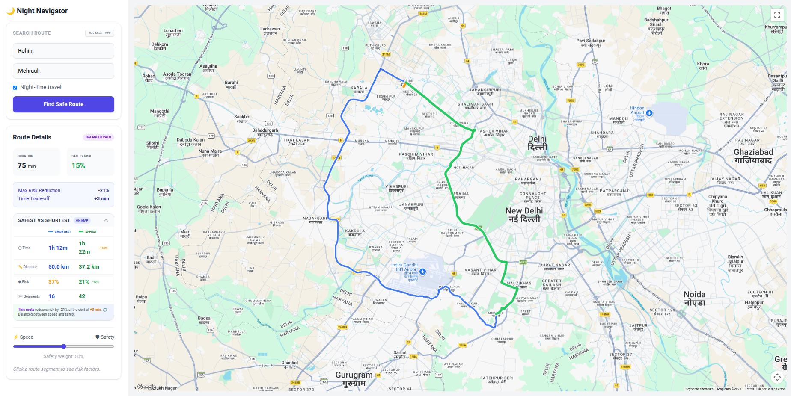
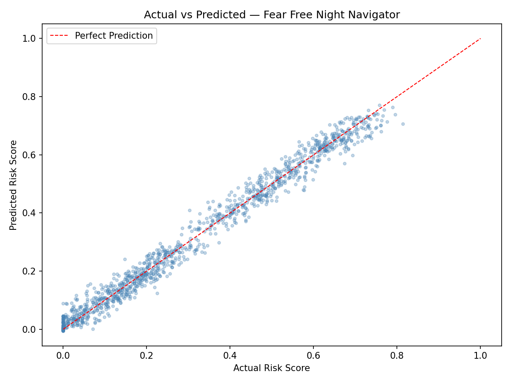
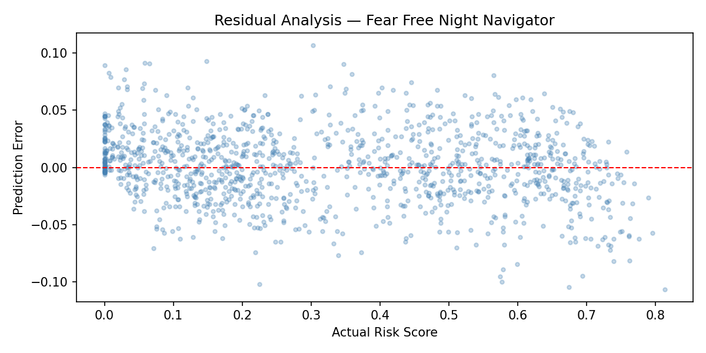
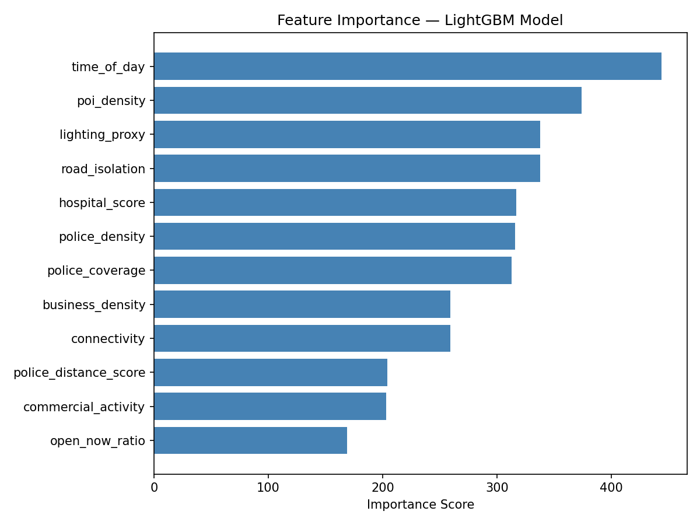
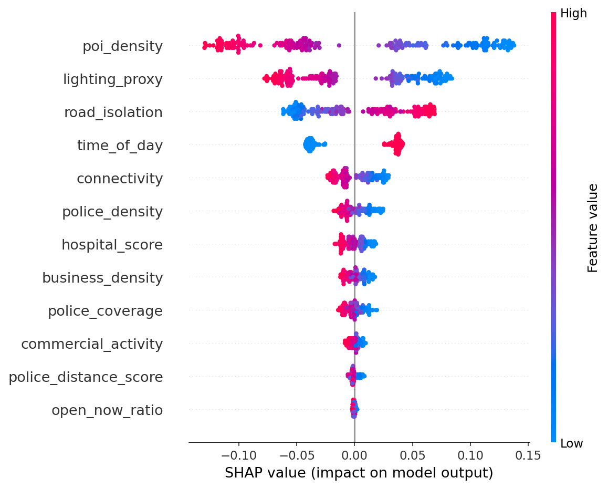

#  Fear-Free Night Navigator

> An AI-powered safety routing system that finds the safest route home at night, showing real-time risk scores and time trade-offs.


---

## What It Does

Given an origin and destination, the app computes two routes simultaneously:

- **Fastest Route** - minimizes travel time
- **Safest Route** - minimizes perceived safety risk using an AI model

Each route segment is scored by a LightGBM model trained on 12 safety features. The map displays segments color-coded green < yellow < red by risk level, and clicking any segment shows a full explanation of its risk factors.

---

## Video Demo

[](https://www.youtube.com/watch?v=UHxsmFrwH9Y)

---


## Demo

**Rohini to Mehrauli, Delhi ,Night-time travel**



```
             FASTEST PATH       SAFEST PATH (balanced)
Time         1h 12m             1h 22m        (+10 min)
Distance     50.0 km            37.2 km
Risk         37%                15%           (-21% )
Segments     16                 42

  "This route reduces risk by 21% at the cost of just +3 min."
```

The safety slider lets users tune between pure speed and pure safety in real time.
At 50% weight, the app finds a genuinely safer path through well-lit, connected roads -
cutting risk nearly in half for only a 3-minute trade-off.

---

## Tech Stack

| Layer | Technology |
|-------|-----------|
| **Frontend** | React 18 + TypeScript + Vite + Tailwind CSS + Zustand |
| **Backend** | Express.js + TypeScript + Mongoose |
| **ML** | Python + Flask + LightGBM + scikit-learn |
| **Database** | MongoDB (with 24-hour TTL caching) |
| **Maps** | Google Maps JavaScript API |

---

## Architecture

```
┌─────────────────┐
│   React (UI)    │  :5173
└────────┬────────┘
         │ HTTP
         ▼
┌─────────────────┐
│  Express API    │  :4000
└────────┬────────┘
         │
    ┌────┴────────────┬──────────────┐
    ▼                 ▼              ▼
┌────────┐     ┌──────────┐   ┌───────────┐
│MongoDB │     │Google    │   │ LightGBM  │  :5001
│(cache) │     │Maps API  │   │ (Flask)   │
└────────┘     └──────────┘   └───────────┘
```

The backend caches segment risk scores in MongoDB with a 24-hour TTL, reducing ML calls by ~70% on repeat routes.

---

## ML Model Performance

The risk model is a **LightGBM** regressor trained on 12 safety features. All 4 evaluation criteria pass.

| Metric | Value | Target |
|--------|-------|--------|
| MAE | ~0.034 | < 0.05  |
| RMSE | ~0.041 | - |
| R² | ~0.96 | > 0.85  |
| Spearman Correlation | ~0.949 | > 0.90  |
| Bias | ~0.000 | ≈ 0.00 |

### Actual vs Predicted


Points hug the perfect-prediction line across the full 0–1 risk range, confirming the model generalizes well and doesn't over/underfit any region.

---

### Residual Analysis


Errors are tightly centered around zero with no systematic bias. The slight funnel shape near risk = 0 is expected - very safe segments are easier to predict confidently.

---

### Feature Importance


`time_of_day` is the single strongest predictor, followed closely by `poi_density`, `lighting_proxy`, and `road_isolation` - exactly the features that matter for night-time safety.

---

### SHAP Explainability


SHAP values confirm the feature importance ranking and reveal directionality:
- **High `poi_density`** (blue dots, right side) → lower risk 
- **High `road_isolation`** (red dots, right side) → higher risk 
- **High `lighting_proxy`** (blue dots, right side) → lower risk 
- **Night time `time_of_day`** (red dot, right side) → higher risk 

This is what powers the per-segment explanations in the app UI.

---

## Running the Evaluation

Make sure the model is trained first, then:

```bash
cd ml
source venv/bin/activate      # macOS/Linux
# venv\Scripts\activate       # Windows

python evaluate.py
```

**What it needs:**
- `model.pkl` - generated by `python train.py`
- `test_results.csv` (preferred) or `dataset.csv` as fallback

**What it produces:**

| Output | Description |
|--------|-------------|
| Printed report | MAE, RMSE, R², Spearman, bias, pass/fail |
| `metrics.json` | All metrics in JSON (used by `/metrics` API endpoint) |
| `residuals.png` | Residual analysis plot |
| `feature_importance.png` | LightGBM feature importance chart |
| `actual_vs_predicted.png` | Actual vs predicted scatter plot |
| `shap_summary.png` | SHAP explainability plot (requires `pip install shap`) |

**Example output:**
```
============================================================
        MODEL EVALUATION REPORT
============================================================

  MAE:              0.0340   (target < 0.05)
  RMSE:             0.0412
  R²:               0.9601   (target > 0.85)
  Spearman Corr:    0.9490   (target > 0.90)

  Bias:             0.0001   (target ≈ 0.00)

  MAE < 0.05
  R² > 0.85
  Spearman > 0.90
  Bias < 0.01

  ALL EVALUATION CRITERIA MET
============================================================
```

> To generate SHAP plots, install the shap library first: `pip install shap`

---

## Quick Start

### Prerequisites
- Node.js v18+
- Python 3.8+
- MongoDB (local or Docker)

### 1. Automated Setup (Recommended)

```bash
git clone https://github.com/yourusername/fear-free-night-navigator.git
cd fear-free-night-navigator
chmod +x SETUPALL.sh
./SETUPALL.sh
```

### 2. Manual Setup

```bash
# Install JS dependencies
npm install
cd backend && npm install
cd ../frontend && npm install

# Set up Python ML environment
cd ../ml
python3 -m venv venv
source venv/bin/activate       # macOS/Linux
# venv\Scripts\activate        # Windows
pip install -r requirements.txt

# Train the model
python generate_dataset.py
python train.py
python evaluate.py             # Check metrics + generate plots 
```

### 3. Configure Environment

Create `backend/.env`:
```env
PORT=4000
MONGO_URI=mongodb://localhost:27017/fearfree
GOOGLE_MAPS_API_KEY=your_key_here
ML_SIDECAR_URL=http://localhost:5001
NODE_ENV=development
```

Create `frontend/.env`:
```env
VITE_BACKEND_URL=http://localhost:4000
VITE_GOOGLE_MAPS_KEY=your_key_here
```

> **No Google Maps API key?** The backend and ML still run fully - only the interactive map display requires one.

### 4. Start MongoDB

```bash
brew services start mongodb-community    # macOS
sudo systemctl start mongod              # Linux
docker run -d -p 27017:27017 mongo       # Docker
```

### 5. Run Everything

```bash
npm run dev
```

| Service | URL |
|---------|-----|
| Frontend | http://localhost:5173 |
| Backend API | http://localhost:4000 |
| ML Sidecar | http://localhost:5001 |

---

## API Endpoints

```
GET  /health                     → Service health check
POST /route                      → Compute fastest + safest routes
POST /segment-score              → Score a single road segment
GET  /explain/:segmentId         → Explain risk factors for a segment
```

**Example - POST /route:**
```json
{
  "origin": "Connaught Place, Delhi",
  "destination": "India Gate, Delhi",
  "time_of_day": 1
}
```

**Response:**
```json
{
  "fastest": { "segments": [...], "avg_risk": 0.42, "duration_secs": 720 },
  "safest":  { "segments": [...], "avg_risk": 0.28, "duration_secs": 840 },
  "risk_reduction": "33%",
  "eta_tradeoff_secs": 120
}
```

---

## ML Features (12 total)

| Feature | What It Measures |
|---------|-----------------|
| `poi_density` | Density of nearby points of interest |
| `commercial_activity` | Level of commercial presence |
| `road_isolation` | How isolated the road segment is |
| `connectivity` | Network connectivity of the segment |
| `lighting_proxy` | Estimated street lighting level |
| `time_of_day` | 0 = day, 1 = night |
| `police_density` | Nearby police presence |
| `police_distance_score` | Proximity to nearest police station |
| `police_coverage` | Police patrol coverage estimate |
| `hospital_score` | Proximity to hospitals |
| `business_density` | Density of open businesses |
| `open_now_ratio` | Ratio of currently open venues |

---

## Testing

```bash
# Backend (Jest - 13 tests)
cd backend && npm test

# ML validation (5 tests)
cd ml && source venv/bin/activate && python test_model.py

# Full evaluation with plots
cd ml && python evaluate.py

# End-to-end
chmod +x run-e2e-test.sh && ./run-e2e-test.sh
```

---

## Project Structure

```
fear-free-night-navigator/
├── backend/
│   └── src/
│       ├── routes/          # 4 API endpoints
│       ├── controllers/     # Business logic
│       ├── services/        # Google Maps, ML scoring, Dijkstra routing
│       ├── models/          # MongoDB schemas (Segment, Route)
│       ├── middleware/      # Error handling
│       ├── config/          # DB connection
│       └── __tests__/       # 13 Jest tests
├── frontend/
│   └── src/
│       ├── components/      # Map, Search, RoutePanel (10 components)
│       ├── store/           # Zustand state
│       ├── api/             # Axios client
│       └── types/           # TypeScript interfaces
├── ml/
│   ├── app.py               # Flask inference server
│   ├── generate_dataset.py
│   ├── train.py
│   ├── evaluate.py          # Metrics + plots generator
│   ├── test_model.py
│   ├── actual_vs_predicted.png
│   ├── feature_importance.png
│   ├── residuals.png
│   └── shap_summary.png
├── SETUP.md
├── SETUPALL.sh
└── run-e2e-test.sh
```

---

## Troubleshooting

| Error | Fix |
|-------|-----|
| `ECONNREFUSED 27017` | Start MongoDB: `brew services start mongodb-community` |
| `EADDRINUSE :4000` | `lsof -ti:4000 \| xargs kill -9` |
| `ML sidecar unreachable` | Run `python train.py` to generate `model.pkl` first |
| `Google Maps 403` | Check API key and enabled APIs in Cloud Console |
| `shap not installed` | `pip install shap` inside the venv |

For detailed setup help, see [SETUP.md](./SETUP.md).

---

## Roadmap

- [ ] Real safety data integration (crime maps, lighting data)
- [ ] User authentication (Firebase/Auth0)
- [ ] Mobile app (React Native)
- [ ] CI/CD pipeline (GitHub Actions)
- [ ] Deploy to Cloud Run + Vercel + MongoDB Atlas
- [ ] Community safety ratings

---

## License

MIT

---

*Built for safer nights*